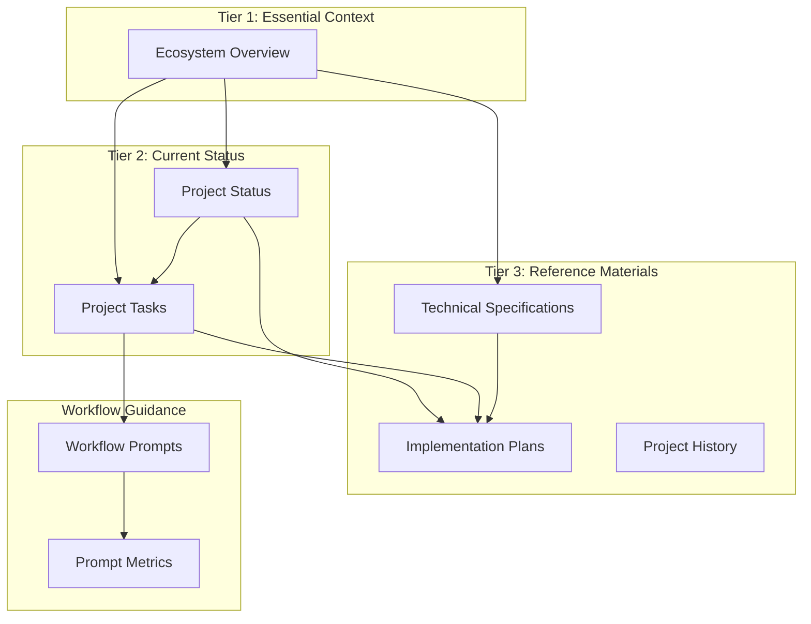

# Documentation Cross-Reference Guide

This document provides a comprehensive cross-reference system to help navigate the interconnected documentation across our Neovim ecosystem projects.

## Core Documentation Map



## Document Index

### Tier 1: Essential Context

| Document | Path | Description | Related Documents |
|----------|------|-------------|-------------------|
| Ecosystem Overview | `/home/gregg/Projects/docs/ecosystem-overview.md` | Core overview of all projects | Project Status, All Task Files |

### Tier 2: Current Status

| Document | Path | Description | Related Documents |
|----------|------|-------------|-------------------|
| Project Status | `/home/gregg/Projects/docs/project-status.md` | Current status of all projects | Project Tasks, Implementation Plans |

#### Project Tasks

| Project | Task File | Related Documents |
|---------|-----------|-------------------|
| Documentation | `/home/gregg/Projects/docs/tasks/documentation-tasks.md` | Documentation Structure Spec |
| Lust-Next | `/home/gregg/Projects/docs/tasks/lust-next-tasks.md` | Lust-Next Architecture Plan |
| Hooks-Util | `/home/gregg/Projects/docs/tasks/hooks-util-tasks.md` | Hooks-Util Architecture Plan, Adapter Architecture Spec |
| Neovim Config | `/home/gregg/Projects/docs/tasks/neovim-config-tasks.md` | - |
| Neovim Plugin Template | `/home/gregg/Projects/docs/tasks/neovim-plugin-template-tasks.md` | Template Repositories Spec |
| Neovim Config Template | `/home/gregg/Projects/docs/tasks/neovim-config-template-tasks.md` | Template Repositories Spec |
| Base Project | `/home/gregg/Projects/docs/tasks/base-project-tasks.md` | Template Repositories Spec |
| Laravel Helper | `/home/gregg/Projects/docs/tasks/laravel-helper-tasks.md` | - |
| Claude Code | `/home/gregg/Projects/docs/tasks/claude-code-tasks.md` | - |
| Nvim Toolkit | `/home/gregg/Projects/docs/tasks/nvim-toolkit-tasks.md` | - |

### Tier 3: Reference Materials

#### Technical Specifications

| Specification | Path | Related Documents |
|---------------|------|-------------------|
| Documentation Structure | `/home/gregg/Projects/docs/specs/documentation-structure.md` | Documentation Tasks |
| Adapter Architecture | `/home/gregg/Projects/docs/specs/adapter-architecture.md` | Hooks-Util Tasks |
| Template Repositories | `/home/gregg/Projects/docs/specs/template-repositories.md` | Base Project Tasks, Template Tasks |
| Test Quality Levels | `/home/gregg/Projects/docs/specs/test-quality-levels.md` | Lust-Next Tasks, Hooks-Util Tasks |

#### Implementation Plans

| Plan | Path | Related Documents |
|------|------|-------------------|
| Lust-Next Architecture | `/home/gregg/Projects/docs/plans/lust-next-architecture.md` | Lust-Next Tasks, Test Quality Levels Spec |
| Hooks-Util Architecture | `/home/gregg/Projects/docs/plans/hooks-util-architecture.md` | Hooks-Util Tasks, Adapter Architecture Spec |

#### Historical Record

| Document | Path | Description |
|----------|------|-------------|
| Project History | `/home/gregg/Projects/docs/project-history.md` | Chronological record of development sessions |

### Workflow Prompts

#### Session Management

| Prompt | Path | Related Documents |
|--------|------|-------------------|
| Startup Prompt | `/home/gregg/Projects/docs/prompts/startup-prompt.md` | Ecosystem Overview, Command Patterns |
| End of Session | `/home/gregg/Projects/docs/prompts/end-of-session.md` | Project Status, Project History, Project Tasks |

#### Development Workflows

| Prompt | Path | Related Documents |
|--------|------|-------------------|
| Project Initialization | `/home/gregg/Projects/docs/prompts/project-initialization.md` | Template Repositories Spec |
| Feature Implementation | `/home/gregg/Projects/docs/prompts/feature-implementation.md` | Project Tasks |
| Bug Fixing | `/home/gregg/Projects/docs/prompts/bug-fixing.md` | - |
| Code Review | `/home/gregg/Projects/docs/prompts/code-review.md` | Test Quality Levels Spec |

#### System Maintenance

| Prompt | Path | Related Documents |
|--------|------|-------------------|
| Command Patterns | `/home/gregg/Projects/docs/prompts/command-patterns.md` | All workflow prompts |
| Ecosystem Review | `/home/gregg/Projects/docs/prompts/ecosystem-review.md` | Project Status |
| Hooks Workflow Maintenance | `/home/gregg/Projects/docs/prompts/hooks-workflow-maintenance.md` | Hooks-Util Tasks |
| Prompts Maintenance | `/home/gregg/Projects/docs/prompts/prompts-maintenance.md` | Prompt Effectiveness, Metrics Review |
| Prompt Effectiveness | `/home/gregg/Projects/docs/prompts/prompt-effectiveness.md` | Metrics Review |
| Metrics Review | `/home/gregg/Projects/docs/prompts/metrics-review.md` | Prompt Effectiveness |

### Templates

| Template | Path | Purpose |
|----------|------|---------|
| CLAUDE.md Template | `/home/gregg/Projects/docs/templates/CLAUDE.md.template` | Standard project-specific documentation |
| Technical Spec with Diagrams | `/home/gregg/Projects/docs/templates/technical-spec-with-diagrams.md` | Creating visual technical specifications |
| FUNDING.yml | `/home/gregg/Projects/docs/templates/FUNDING.yml` | Standard GitHub sponsorship configuration |

## Navigating Documentation

### By Project

To find all documentation related to a specific project:

1. Start with the **Ecosystem Overview** for a high-level understanding
2. Check the project's status in **Project Status**
3. Review current tasks in the project's **Task File**
4. Find project-specific technical details in **Specifications** and **Plans**

### By Workflow

To find guidance for a specific development workflow:

1. Use the appropriate **Workflow Prompt** for step-by-step guidance
2. Reference **Command Patterns** for standardized command usage
3. Check project-specific details in the project's **CLAUDE.md** file

### By Topic

To find all information about a specific topic (e.g., testing):

1. Check the **Test Quality Levels** specification
2. Review testing-related tasks in **Lust-Next Tasks**
3. Look for testing guidance in the **Feature Implementation** and **Bug Fixing** prompts

## Creating Cross-References

When adding new documentation:

1. **Add entries to this guide**: Include the new document in the appropriate section
2. **Include related document links**: Add cross-references at the top or bottom of the document
3. **Use consistent paths**: Always use full paths for cross-references
4. **Update affected documents**: Add references to the new document in related documents

Example cross-reference footer:

```markdown
---

**Related Documentation:**
- [Ecosystem Overview](/home/gregg/Projects/docs/ecosystem-overview.md)
- [Project Status](/home/gregg/Projects/docs/project-status.md)
- [Feature Implementation Workflow](/home/gregg/Projects/docs/prompts/feature-implementation.md)
```