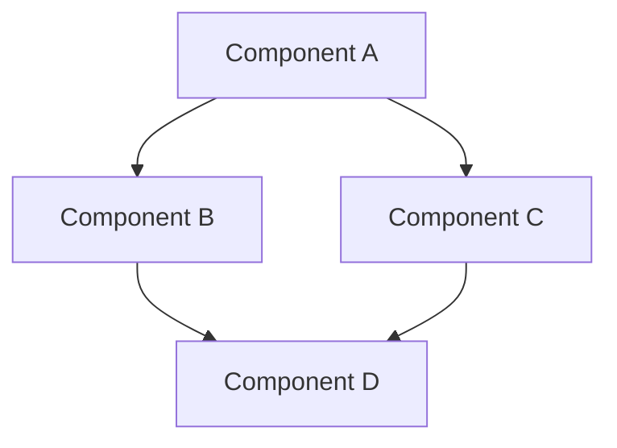
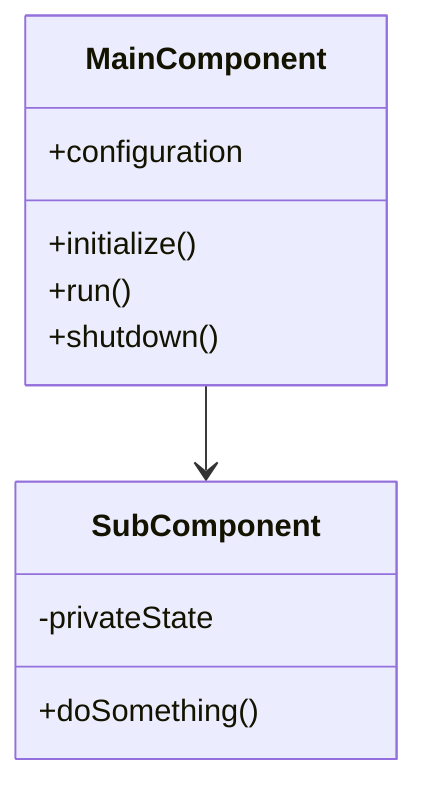
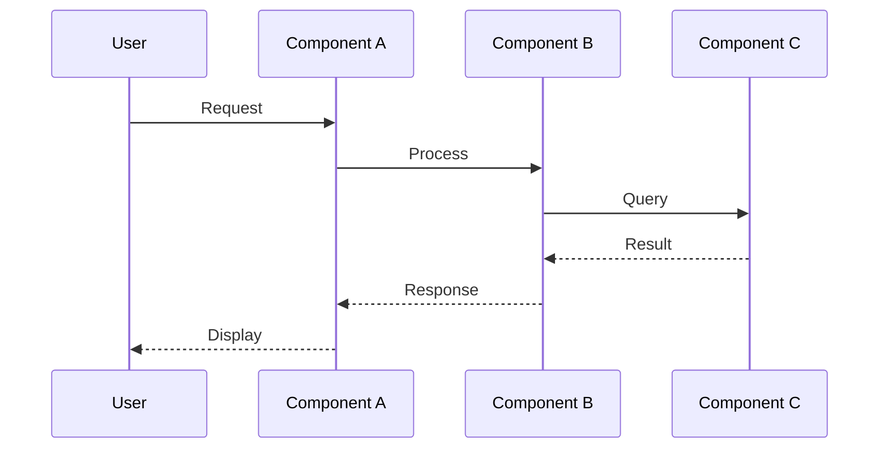
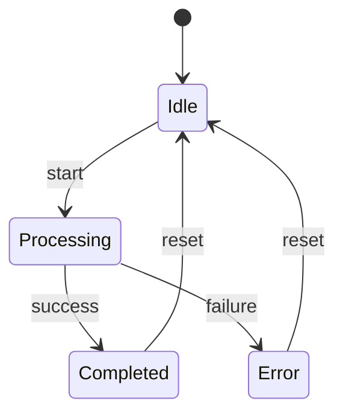
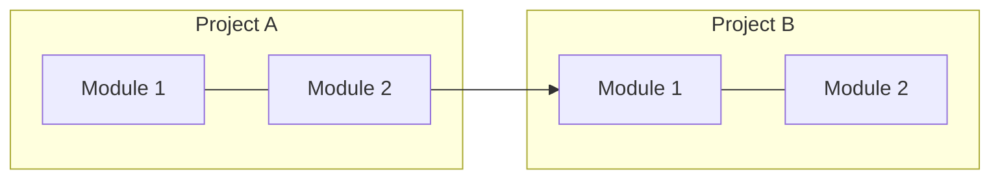

# [Component Name] Technical Specification

## Overview

Brief description of the component and its purpose in the ecosystem.

## Architecture Diagram



*Figure 1: High-level architecture showing component relationships*

## Component Structure



*Figure 2: Component class structure*

## Data Flow



*Figure 3: Data flow sequence between components*

## State Transitions



*Figure 4: Component state transitions*

## Integration Points



*Figure 5: Integration with other ecosystem components*

## Detailed Design

### Key Components

1. **[Component 1]**
   - Purpose: What this component does
   - Responsibilities: Key responsibilities
   - Dependencies: What it depends on

2. **[Component 2]**
   - Purpose: What this component does
   - Responsibilities: Key responsibilities
   - Dependencies: What it depends on

### API Interface

```lua
-- Example API
local Component = {
  -- Configuration options
  default_config = {
    enabled = true,
    debug = false
  }
}

-- Initialize the component
function Component.setup(opts)
  -- Implementation details
end

-- Core functionality
function Component.run()
  -- Implementation details
end

return Component
```

### Data Structures

```lua
-- Key data structure example
local DataModel = {
  id = "unique_identifier",
  metadata = {
    created = timestamp,
    updated = timestamp
  },
  content = {
    -- Content fields
  }
}
```

## Implementation Considerations

### Performance

- Expected performance characteristics
- Potential bottlenecks and mitigation strategies
- Benchmarking approach

### Security

- Security considerations
- Input validation
- Resource access controls

### Error Handling

- Error classification
- Recovery strategies
- Logging and monitoring

## Testing Strategy

### Unit Tests

- Key test cases
- Mocking approach
- Coverage targets

### Integration Tests

- Component interactions to test
- Test environment configuration
- Success criteria

## Open Questions

- List any unresolved questions or decisions
- Include potential options for each

## References

- Links to relevant documentation
- Related components
- External resources

---

*Diagrams created with [Mermaid](https://mermaid-js.github.io/mermaid/). To render these diagrams:*
1. *Use a Markdown editor that supports Mermaid (e.g., VS Code with Markdown Preview Enhanced)*
2. *Use the Mermaid Live Editor: https://mermaid.live/*
3. *Export as SVG/PNG and place in `/home/gregg/Projects/docs-projects/neovim-ecosystem-docs/assets/diagrams/`*